🛍️Crafted Treasures

Bringing handmade artistry to the digital world — a full-stack e-commerce platform for unique, handcrafted products.

📌 Overview

Crafted Treasures is a modern e-commerce web application designed to showcase and sell handmade products created by skilled artisans.

The platform focuses on uniqueness, craftsmanship, and user experience, providing customers with a seamless way to explore and purchase handcrafted items.

✨ Features

    🛒 Product Listing & Categories
    🔍 Search & Filter Functionality
    🔐 User Authentication & Authorization
    🧺 Add to Cart & Checkout
    📦 Order Management System
    📊 Admin Dashboard (Manage Products & Orders)
    📱 Fully Responsive UI
    
🛠️ Tech Stack
  🎨 Frontend
      Angular
      TypeScript
      HTML5, CSS3
      Bootstrap
  ⚙️ Backend
      .NET Core Web API
      Entity Framework Core
  🗄️ Database
      MS SQL Server

## 📸 Screenshots

### 🏠 Home Page

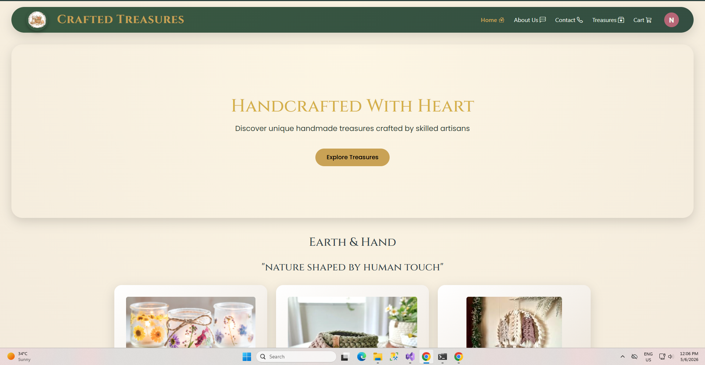

### ℹ️ About Us Page

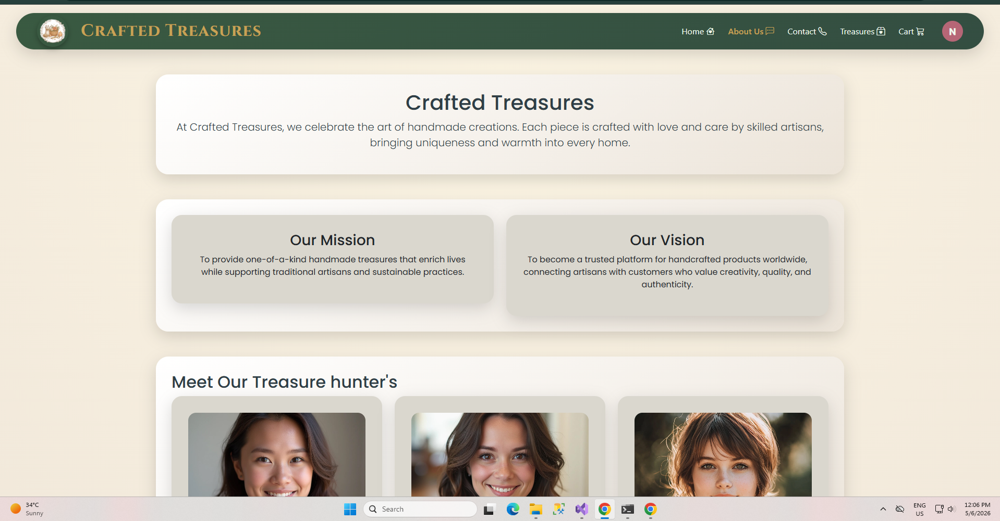

### 📞 Contact Page

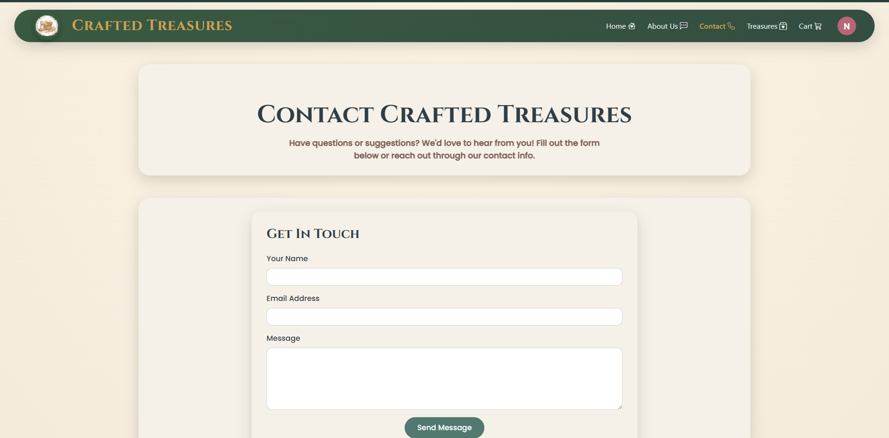

---

## 🛍️ User Features

### 🎁 Featured Treasures

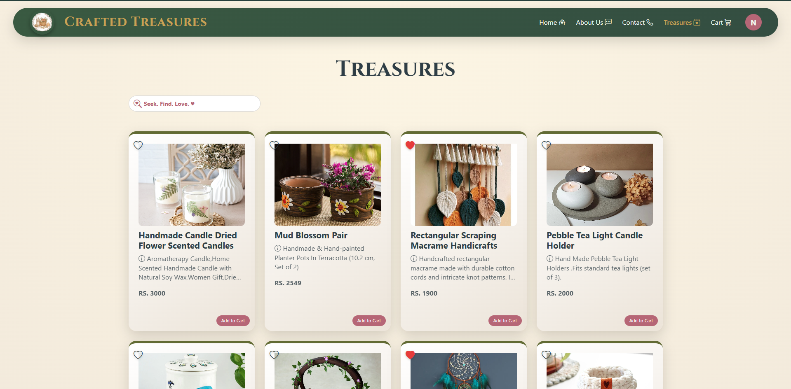
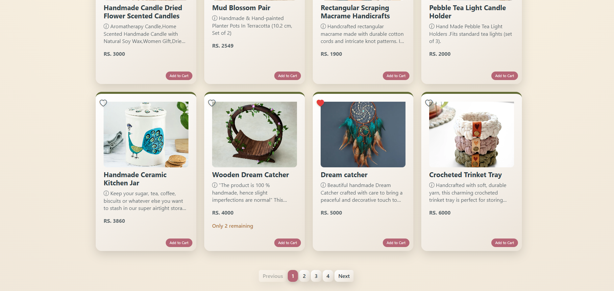

### ❤️ Wishlist

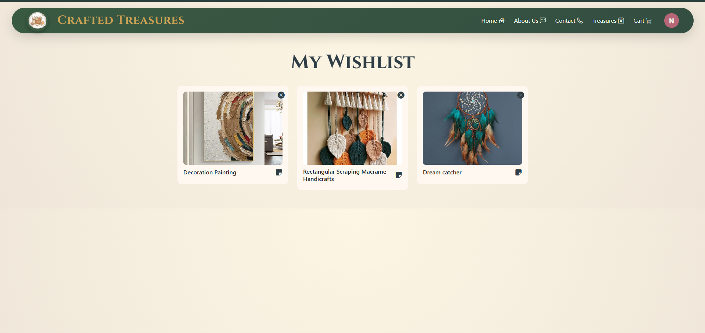

### 🧺 Cart

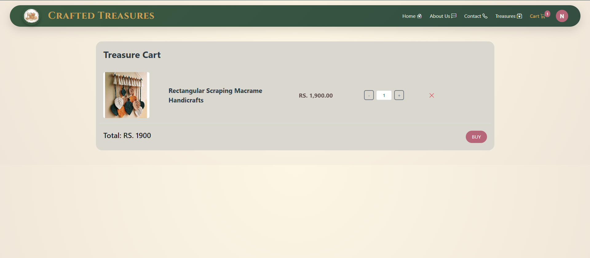

### 💳 Checkout

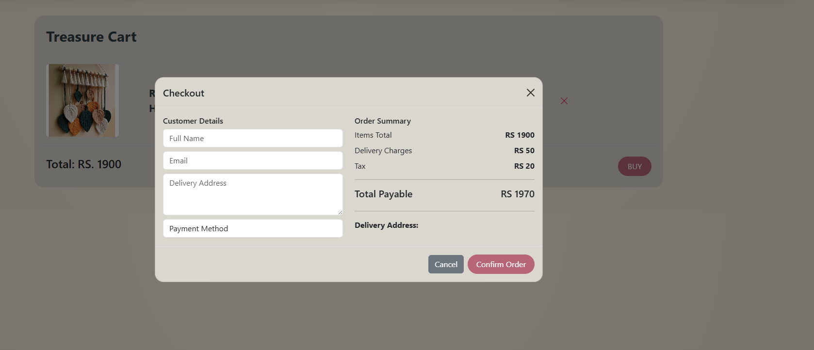

### 📦 Order History

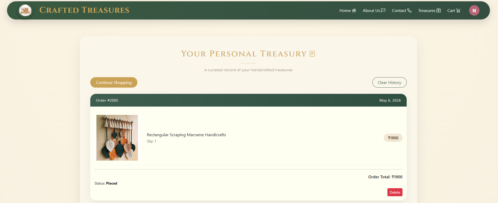

---

## 🔐 Admin Panel

### 📊 Admin Dashboard

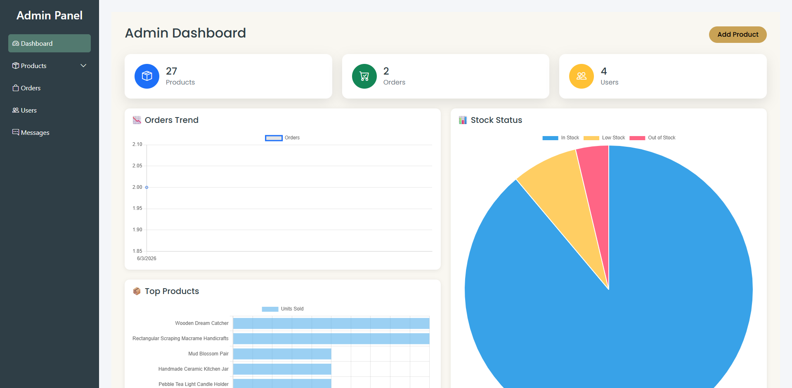

### ➕ Add Product

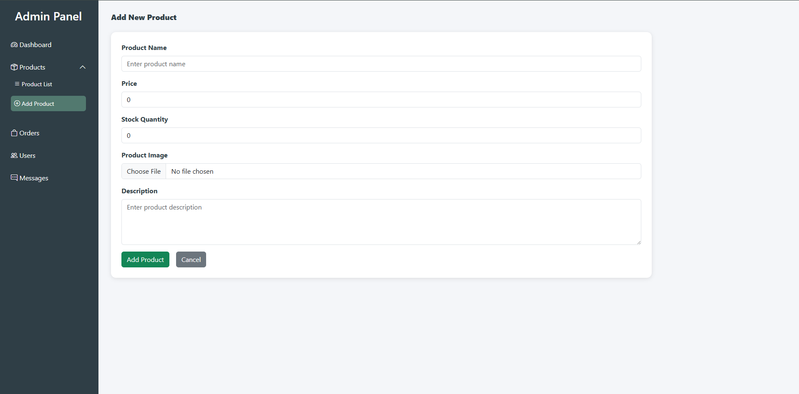

### 🛒 Product Listing

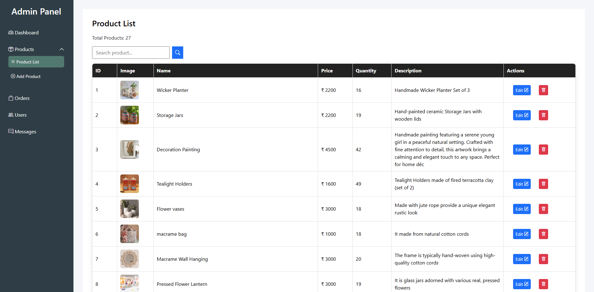

### 📦 Order Management

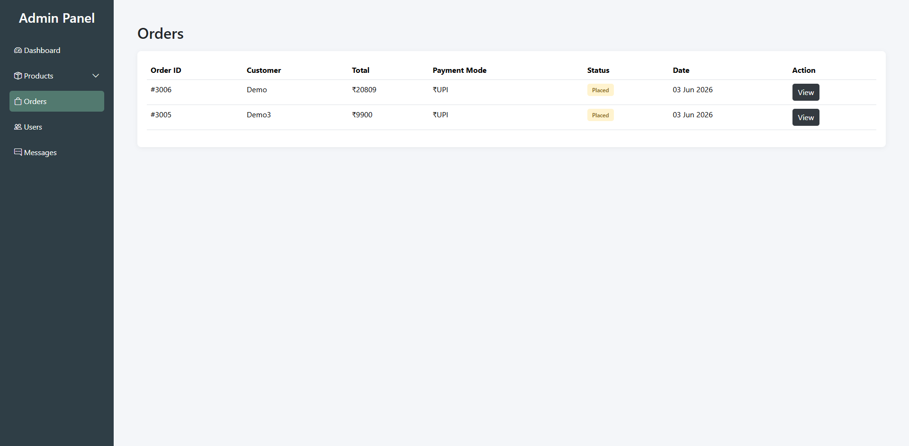

### 👤 User Management

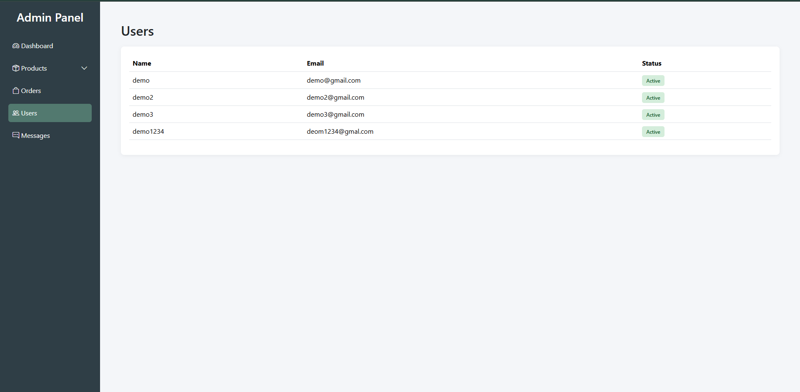

### 👤 User Messages

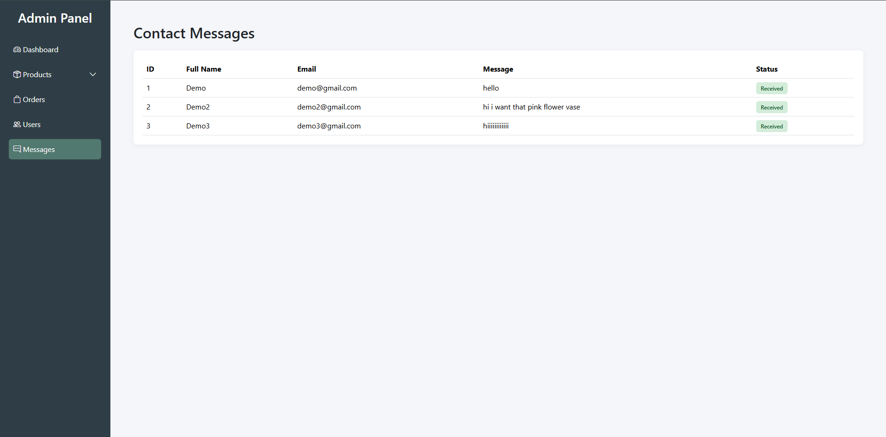

